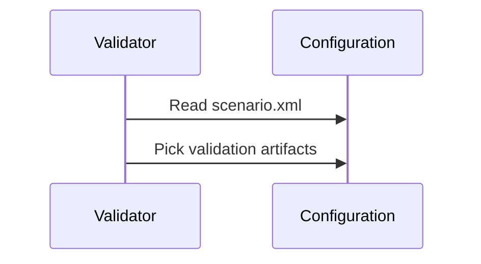

# General Architecture

The validator itself is just an engine which executes validation according to a certain configuration (see [configuration documentation](configuration.md))

Eine zu prüfende Datei durchläuft die folgenden Schritte

Eine zu prüfende Datei durchläuft die folgenden Schritte   

1. *Grundsätzliche XML-Prüfung*: Es muss sich bei der zu prüfenden Datei um wohlgeformtes XML handeln, andernfalls
   werden keine weiteren Prüfungen durchgeführt und ein [Prüfbericht] mit Status *invalid* und Empfehlung 
    *reject* generiert.
2. *Identifikation des anzuwendenden Prüfszenarios*: Für den Dokumenttyp der zu prüfenden XML-Datei muss in der
    [Konfigurationsdatei](#konfiguration-des-prüftools) ein Prüfszenario definiert sein (die Identifikation des
    Dokumenttyps erfolgt durch einen XPath-Test), andernfalls werden keine weiteren Prüfungen durchgeführt und ein
    [Prüfbericht] mit Status *invalid* und Empfehlung *reject* generiert.
3. *Prüfung gegen das XML-Schema des identifizierten Dokumenttyps*: Das zu prüfende Dokument muss valide bzgl. des
    Schemas sein, andernfalls werden keine weiteren Prüfungen durchgeführt und ein [Prüfbericht] mit Status *invalid*
    und Empfehlung *reject* generiert.
4. *Prüfung gegen die Schematron-Regeln des identifizierten Dokumenttyps*
5. *Aggregation und Bewertung der einzelnen Prüfungen* zu einem [Prüfbericht]: Die Ergebnisse der
    vorherigen Schritte werden in einem einheitlichen Berichtsformat zusammengefasst und bewertet:
    * Sofern mindestens einer der zuvor durchgeführten Prüfschritte einen Fehler (*error*) oder eine Warnung (*warning*)
      geliefert hat, erhält der Prüfbericht den Status *invalid*, andernfalls erhält er den Status *valid*.
    * Sofern einer der Prüfschritte einen Fehler geliefert hat, erhält der Prüfbericht grundsätzlich die Empfehlung
      *reject*, andernfalls erhält er die Empfehlung *accept*. 
    * In der [Konfigurationsdatei](#konfiguration-des-prüftools) kann für einzelne Prüfregeln festgelegt werden, dass
      sie für die Bewertung einer [anderen Meldungsart](#anpassung-der-fehlergrade-für-die-bewertung) zuzuordnen sind
      (z. B. *warning* anstelle von *error*).  
    * Der Prüfbericht ist ein für die maschinelle Auswertung geeignetes XML-Dokument. Darin eingebettet ist auch eine 
      für menschliche Leser bestimmte HTML-Aufbereitung des Prüfergebnisses. Die Details dieser HTML-Aufbereitung können
      bei Bedarf [angepasst](#anpassung-der-html-ausgabe) werden.
    

