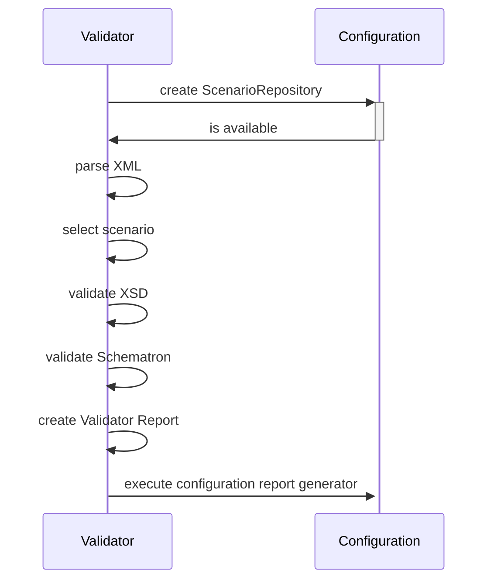

# General Architecture

The validator itself is just an engine which executes validation according to a certain configuration (see [configuration documentation](docs/configurations.md)).

The validator takes a scenario.xml and the configured directory with all artifacts necessary for validation (scenario repository). Then it performs
the validation and generates a report in XML format. This report is then the input to an XSLT provided by the configuration.

## Separation of concerns

* The purpose of the validator is to only report if an XML instance is valid or not
* A configuration can provide an XSLT which takes the validator report and generates an own report
  * This report may choose to conclude acceptance of the XML instance or not

The validator reports valid/invalid, a configuration reports acceptance/rejection!

## General process

The general process is like this:

1. *parse XML*:

    Is the XML instance valid in the basic sense. If not, validation is stopped and the validator report is returned with status *invalid*.
2. *select scenario*:

    The configuration must have a defined scenario which matches the XML instance (it is an XPATH expression). If no scenario matches, validation is stopped and the validator report is returned with status *invalid*.
3. *validate XML-Schema*:

    The XML instance must be valid according to the configured XSD. If not, validation is stopped and the validator report is returned with status *invalid*.
4. *validate Schematron*
5. *create Validator Report*:

    All results are aggregated into the validation report:
    * Depending on the configuration in the scenario, if there is a single *error* or *warning* the report will have status *invalid*, otherwise the status will be *valid*.
6. *execute configuration report generator*

    The Validator will search for the XSLT as configured in scenario.xml and execute it with the Validator Report as input
