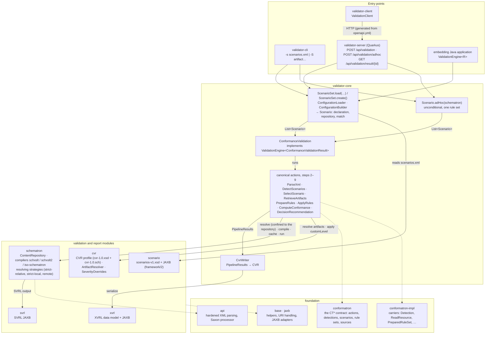
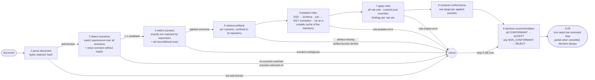
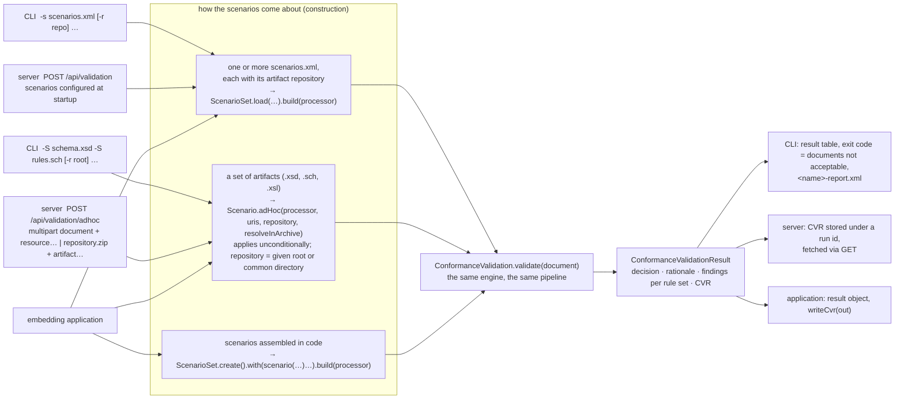
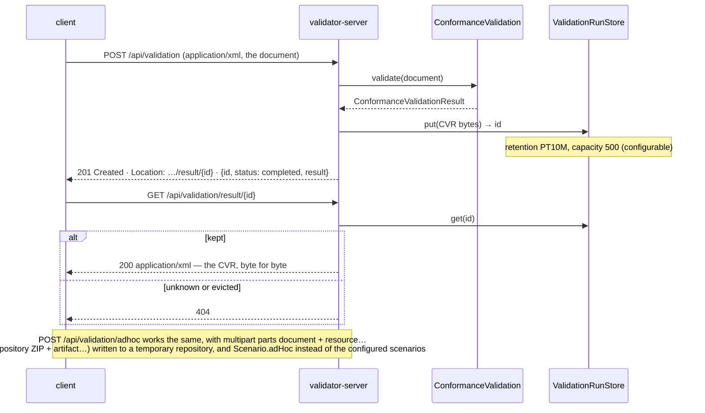

# Architecture

The validator is an engine that validates a document along the scenarios it was assembled with and reports the result as a
**Conformance Validation Report (CVR)** — the XVRL profile of the validator. It knows nothing about XRechnung or any other
format: the scenarios ([configuration](configurations.md)) bring the match expressions, the XML schemas and the Schematron
rule sets; the engine brings the pipeline, the resolving rules and the report.

Two things are fixed by the conformatron API and hold for every entry point: the **nine canonical steps** the pipeline
consists of (the validator implements steps 2–9, step 1 `detect-syntax` is not implemented), and the **cancel semantics** —
a step that does not succeed ends the run, and the run still produces a partial CVR with an explicit decision, never an
exception or an HTTP error.

## Overall architecture

```mermaid
flowchart TB
    subgraph entry["Entry points"]
        CLI["validator-cli<br/>-s scenarios.xml | -S artifact…"]
        SRV["validator-server (Quarkus)<br/>POST /api/validation · POST /api/validation/adhoc<br/>GET /api/validation/result/{id}"]
        CLT["validator-client<br/>ValidationClient"]
        APP["embedding Java application<br/>ValidationEngine&lt;R&gt;"]
    end
    CLT -- "HTTP (generated from openapi.yml)" --> SRV

    subgraph core["validator-core"]
        LOAD["ScenarioSet.load(…) / ScenarioSet.create()<br/>ConfigurationLoader · ConfigurationBuilder<br/>→ Scenario: declaration, repository, match"]
        ADHOC["Scenario.adHoc(schematron)<br/>unconditional, one rule set"]
        ENG["ConformanceValidation<br/>implements ValidationEngine&lt;ConformanceValidationResult&gt;"]
        ACT["canonical actions, steps 2–9<br/>ParseXml · DetectScenarios · SelectScenario · RetrieveArtifacts<br/>PrepareRules · ApplyRules · ComputeConformance · DecisionRecommendation"]
        WR["CvrWriter<br/>PipelineResults → CVR"]
    end
    CLI --> LOAD
    CLI --> ADHOC
    SRV --> LOAD
    SRV --> ADHOC
    APP --> LOAD
    LOAD -- "List&lt;Scenario&gt;" --> ENG
    ADHOC -- "List&lt;Scenario&gt;" --> ENG
    ENG -- "runs" --> ACT
    ACT -- "PipelineResults" --> WR

    subgraph engines["validation and report modules"]
        SCH["schematron<br/>ContentRepository · compilers schxslt / schxslt2 / iso-schematron<br/>resolving strategies (strict-relative, strict-local, remote)"]
        CVRM["cvr<br/>CVR profile (cvr-1.0.xsd + cvr-1.0.sch) · ArtifactResolver · SeverityOverrides"]
        XVRL["xvrl<br/>XVRL data model + JAXB"]
        SCEN["scenario<br/>scenarios-v1.xsd + JAXB (framework/2)"]
        SVRL["svrl<br/>SVRL JAXB"]
    end
    LOAD -- "reads scenarios.xml" --> SCEN
    ACT -- "resolve (confined to the repository) · compile · cache · run" --> SCH
    ACT -- "resolve artifacts · apply customLevel" --> CVRM
    SCH -- "SVRL output" --> SVRL
    WR -- "serialize" --> XVRL

    subgraph found["foundation"]
        CTAPI["conformatron<br/>the CT* contract: actions, detections, scenarios, rule sets, sources"]
        CTIMPL["conformatron-impl<br/>carriers: Detection, ReadResource, PreparedRuleSet, …"]
        API["api<br/>hardened XML parsing, Saxon processor"]
        BASE["base · jaxb<br/>helpers, URI handling, JAXB adapters"]
    end
    ACT -.-> CTAPI
    ACT -.-> CTIMPL
    SCH -.-> API
    engines -.-> BASE
```

*Reading the picture:* the entry points differ only in how they **assemble** the engine — over the scenarios of one or more
`scenarios.xml` (each with its own artifact repository), over a scenario built at runtime from a set of artifacts (ad hoc),
or in code through the builder API. From there on everything is the same engine, the same pipeline and the same report.
Configuration is a construction concern (ADR-008): `validate(document)` takes nothing but the document.

What the modules are for:

| Module | Role |
|---|---|
| `conformatron`, `conformatron-impl` | the conformatron API — the contract every step, detection and handshake object follows — and the validator's carrier implementations of it |
| `base`, `jaxb`, `api` | helpers (URIs into archives, strings, secure XML factories), JAXB adapters, hardened XML parsing and the shared Saxon processor |
| `scenario` | the scenario schema `scenarios-v1.xsd` (namespace `…/framework/2/scenarios`) and its JAXB binding |
| `schematron` | the technical validation engine: `ContentRepository` (compile cache, resolving confined to one repository), the Schematron compilers `schxslt`, `schxslt2`, `iso-schematron`, the resolving strategies |
| `svrl`, `xvrl` | the JAXB bindings of SVRL (Schematron output) and XVRL (the report language) plus the XVRL data model |
| `cvr` | what makes an XVRL report a CVR: the profile (`cvr-1.0.xsd` extension vocabulary, `cvr-1.0.sch` with 63 assertions, `CvrProfile.validate`), the `ArtifactResolver` of step 5 and the `SeverityOverrides` of step 7 |
| `core` | the engine: `Scenario`, `ScenarioSet`, loader and builders, the eight actions, `ConformanceValidation`, `ConformanceValidationResult`, `CvrWriter` |
| `cli`, `server`, `client` | the entry points — see [CLI](cli.md), [server](server.md), [client](client.md) |
| `test-data` | the shared fixtures (`examples/simple/…`) every module tests against |

## Runtime processes

### The pipeline of one run

Every validation, whatever the entry point, is this run. Steps 3 and 4 decide *which* scenarios apply, steps 5 to 8 run
*per applied scenario* where the scenario matters (its repository, its rule sets, its conformance target), step 9 always runs.

```mermaid
flowchart LR
    DOC([document]) --> S2["2 parse-document<br/>bytes retained, hash"]
    S2 -- "well-formed" --> S3["3 detect-scenarios<br/>match expressions over all scenarios<br/>+ every scenario without match"]
    S3 -- "≥ 1 candidate" --> S4["4 select-scenario<br/>exactly one matched by expression<br/>+ all unconditional ones"]
    S4 -- "applied scenarios" --> S5["5 retrieve-artifacts<br/>per scenario, confined to its repository"]
    S5 --> S6["6 prepare-rules<br/>XSD → Schema · .sch → XSLT (compiler) · .xsl as is<br/>compile cache of the repository"]
    S6 --> S7["7 apply-rules<br/>all rule sets · customLevel overrides<br/>findings per rule set"]
    S7 --> S8["8 compute-conformance<br/>one target per applied scenario"]
    S8 --> S9["9 decision-recommendation<br/>all CONFORMANT → ACCEPT<br/>any NON_CONFORMANT → REJECT"]

    S2 -- "not well-formed" --> X((cancel))
    S3 -- "no-scenario-matched<br/>scenario-unknown-id" --> X
    S4 -- "scenario-ambiguous" --> X
    S5 -- "artifact-missing<br/>artifact-access-denied" --> X
    S6 -- "rule-prepare-error" --> X
    S7 -- "rule-engine-error" --> X
    X -- "step 9 still runs" --> S9
    S9 --> CVR([CVR<br/>one report per executed step<br/>partial when cancelled, decision always])
```

The report is written from the results of every step the run reached (`PipelineResults`). A cancelled run is a completed
report: the steps that ran, the detection that cancelled, the decision `REJECT` with the cancellation as rationale — and the
same profile-valid CVR as a run that went through.

### How the entry points assemble the engine

```mermaid
flowchart LR
    subgraph how["how the scenarios come about (construction)"]
        A1["one or more scenarios.xml,<br/>each with its artifact repository<br/>→ ScenarioSet.load(…).build(processor)"]
        A2["a set of artifacts (.xsd, .sch, .xsl)<br/>→ Scenario.adHoc(processor, uris, repository, resolveInArchive)<br/>applies unconditionally; repository = given root or common directory"]
        A3["scenarios assembled in code<br/>→ ScenarioSet.create().with(scenario(…)…).build(processor)"]
    end
    CLI1["CLI  -s scenarios.xml [-r repo] …"] --> A1
    CLI2["CLI  -S schema.xsd -S rules.sch [-r root] …"] --> A2
    SRV1["server  POST /api/validation<br/>scenarios configured at startup"] --> A1
    SRV2["server  POST /api/validation/adhoc<br/>multipart document + resource… | repository.zip + artifact…"] --> A2
    APP["embedding application"] --> A1
    APP --> A2
    APP --> A3
    A1 --> E["ConformanceValidation.validate(document)<br/>the same engine, the same pipeline"]
    A2 --> E
    A3 --> E
    E --> R["ConformanceValidationResult<br/>decision · rationale · findings per rule set · CVR"]
    R --> O1["CLI: result table, exit code = documents not acceptable,<br/>&lt;name&gt;-report.xml"]
    R --> O2["server: CVR stored under a run id,<br/>fetched via GET"]
    R --> O3["application: result object, writeCvr(out)"]
```

### The server protocol

The server treats a validation as a resource (RFC 9110, §9.3.3): creating it is a `POST` that answers `201 Created` with the
location of the result; the result is fetched with `GET` for as long as the server keeps it.

```mermaid
sequenceDiagram
    participant C as client
    participant S as validator-server
    participant E as ConformanceValidation
    participant St as ValidationRunStore

    C->>S: POST /api/validation (application/xml, the document)
    S->>E: validate(document)
    E-->>S: ConformanceValidationResult
    S->>St: put(CVR bytes) → id
    Note over St: retention PT10M, capacity 500 (configurable)
    S-->>C: 201 Created · Location: …/result/{id} · {id, status: completed, result}
    C->>S: GET /api/validation/result/{id}
    S->>St: get(id)
    alt kept
        S-->>C: 200 application/xml — the CVR, byte for byte
    else unknown or evicted
        S-->>C: 404
    end
    Note over C,S: POST /api/validation/adhoc works the same, with multipart parts document + resource…<br/>(or repository ZIP + artifact…) written to a temporary repository, and Scenario.adHoc instead of the configured scenarios
```

A document that does not parse is **not** a `400`: it creates a run like any other, the pipeline cancels at
`parse-document`, and the result is the partial CVR that says so.

## Separation of concerns

* The engine reports **what it found** (per rule set, with the declared and the effective severity) and **what it
  concludes** (conformance per target, the decision). It does not render a business report: the CVR is the report, and it
  is the same for every entry point.
* The configuration decides **what is checked** (match, schemas, rule sets, the Schematron processor per rule set) and
  **how findings weigh** (`customLevel` per rule set). It no longer carries a report transformation (`createReport` of 1.x)
  or an accept expression that is evaluated (`acceptMatch` is kept but not evaluated).
* Resolving is a security boundary: every artifact of a scenario is resolved **confined to the repository of that
  scenario**; a reference that escapes it is `artifact-access-denied`, not a fetch.

## Where this differs from 1.6

1.6 ran `DefaultCheck` with a fixed sequence (parse, select one scenario or the fallback, XSD, Schematron, create the
XVRL, render the configured report XSLT, compute acceptance from an `acceptMatch` XPath over that report). 2.0 keeps the
verdict logic (the 150-instance XRechnung corpus decides identically: 118 accept, 32 reject) but not the mechanics: no
fallback scenario, no eager compilation at load time, no report XSLT, no `acceptMatch` evaluation, several conformance
targets per run, and one engine instead of a check hierarchy. The details are on the documentation site under
*Unterschiede zu 1.6*.
